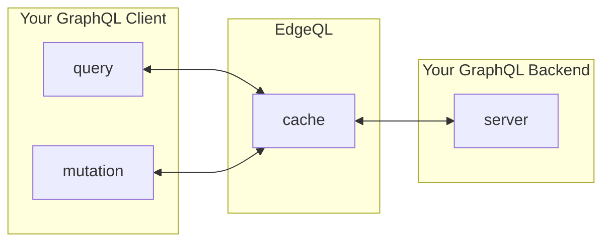

# EdgeQL 
EdgeQL is a fast GraphQL CDN on Cloudflare Edge, delivering optimized GraphQL responses with low latency. Easy to use and integrate, EdgeQL leverages Cloudflare's powerful caching and delivery network for improved performance and reliability.

### How it works

